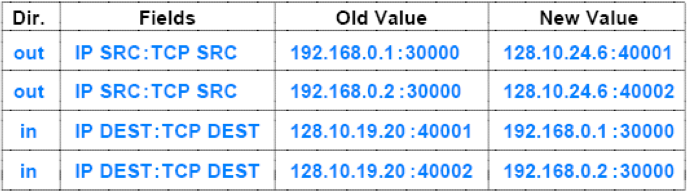

## 计算机网络考点归纳

### Ⅰ. 选择题
由**problem**组成, 配合**ppt**服用更佳.

### Ⅱ. 名词解释
* Peer-to-peer Protocl (P2PP) [wiki][p2pp]
>Peer-to-Peer Protocol is an application layer peer-to-peer networking protocol that can be used to form and maintain an overlay network among participant nodes. 

* Flow-Control `3.4`
> The sending station must not send frames at a rate faster
than the receiving station can absorb them.
* Stop-And-Wait ARQ `3.7`
>Stop-and-wait flow control is the simplest form of flow control. In this method, the receiver indicates its readiness to receive data for each frame, the message is broken into multiple frames. The sender waits for an ACK (acknowledgement) after every frame for specified time (called time out). It is sent to ensure that the receiver has received the frame correctly. It will then send the next frame only after the ACK has been received.

* Synchronous Transmission `2.17`
> synchronization. The receiver must know the rate at which bits are being received so that it can sample the line at appropriate intervals to determine the value of each received bit.

* Asychronous Transmission `2.17` 
>asynchronous transmission, each character of data is treated independently. Each
character begins with a start bit that alerts the receiver that a character is arriving. The receiver samples each bit in the character and then looks for the beginning of the next character. 

* HTTP `13.15`
>HyperText Transfer Protocol(Http)
>
>a transfer protocol that specifies how a browser interacts with a web server to transfer data

* HTML `13.12`
>HyperText Markup Language(HTML)
>
>HyperText Markup Language  (HTML) is a representation standard that specifies the syntax of a web page

* DNS `13.32`
>Domain Name System (DNS)   
>
> DNS provides a service that maps human-readable symbolic names to computer addresses

* DHCP `11.42`
>Dynamic Host Configuration Protocol 
>
>DHCP allows a computer to join a new network and obtain an IP address automatically

* Circuit Switching And Packet Switching
	* Circuit Switching `5.10`
	>A network built around a single circuit-switching node consists of a collection of stations attached to a central switching unit. The central switch establishes a dedicated path between any two devices that wish to communicate. The heart of a modern system is a digital switch. The function of the digital switch is to provide a transparent signal path between any pair of attached devices. Typically, the connection must allow full-duplex transmission.

	* Packet Switching `5.19`
	>Packet switching is a digital networking communications method that groups all transmitted data – regardless of content, type, or structure – into suitably sized blocks, called packet.

	* This approach has a number of advantages over circuit switching: `5.22`
	>* **Line efficiency is greater**, because a single node-to-node link can be dynamically shared by many packets over time.The packets are queued up and transmitted as rapidly as possible over the link. By contrast, with circuit switching, time on a node-to-node link is preallocated using synchronous time division multiplexing. Much of the time, such a link may be idle because a portion of its time is dedicated to a connection that is idle.
	>* A packet-switching network can perform **data-rate conversion**.Two stations of different data rates can exchange packets because each connects to its node at its proper data rate.
	>* **Usually do not reject packets**. When traffic becomes heavy on a circuit-switching network, some calls are blocked; that is, the network refuses to accept additional connection requests until the load on the network decreases. On a packet-switching network, packets are still accepted, but delivery delay increases.
	>* **Priorities can be used**. If a node has a number of packets queued for transmission, it can transmit the higher-priority packets first.These packets will therefore experience less delay than lower-priority packets.
* Network Address Transmission(NAT) `11.53`
>* The Internet has expanded and addresses became scarce  
-- subnet and classless addressing (CIDR) were introduced to help conserve addresses
>* Another mechanism was invented that allows multiple computers at a site to share a single, globally valid IP address, known as **Network Address Translation (NAT)**
>* NAT provides **transparent communication**   
-- a host in the Internet always appears to receive communication from a single computer rather than from one of many computers at the site
>* NAT runs as an **in-line service**   
-- It must be placed on the connection between the Internet and a site
>* Most implementations embed NAT in another device   
-- such as a Wi-Fi wireless access point or an Internet router

* Transport-Layer NAT (NAPT) `11.56`
>* Recall: applications use protocol port numbers to distinguish among services  
-- So NAPT uses port numbers to associate each datagram with a TCP or UDP flow
>* NAPT entries contain a **4-tuple** of source and destination IP addresses and protocol port numbers
>* To avoid a conflict  
-- NAPT must choose an alternative TCP source port for the connections

<!--
hw6 ip地址划分
路由算法 ppt6
ig hw4
hw5 pre3
ig hw8
hw7 ig 选择题
hw2 16 17 18 19
ig hw3
hw1 all
-->
[p2pp]:https://en.wikipedia.org/wiki/Peer-to-Peer_Protocol_(P2PP)